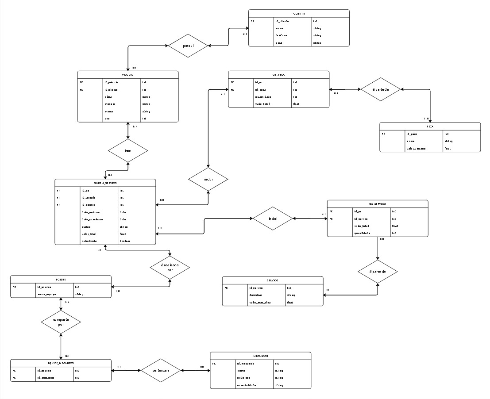

# Modelo Conceitual - Oficina Mecânica

## 📌 Objetivo 
Este projeto representa o modelo conceitual de banco de dados para um sistema de controle e gerenciamento de ordens de serviço em uma oficina mecânica. Foi desenvolvido como parte do Bootcamp "Inteligência Artificial Aplicada a Dados com Copilot" da DIO.

## 💡 Descrição do Desafio
Este projeto consiste na criação de um modelo conceitual de banco de dados para uma oficina mecânica, com base em uma narrativa proposta no bootcamp Inteligência Artificial Aplicada a Dados com Copilot - DIO.

🛠️ Objetivo
Modelar as entidades, atributos e relacionamentos a partir do cenário onde:

Clientes levam veículos para revisões ou consertos;

Cada veículo é associado a uma equipe de mecânicos;

Os serviços executados são registrados em Ordens de Serviço (OS) com data, valor, status e previsão de conclusão;

Os custos são definidos com base em mão de obra e peças utilizadas;

A mesma equipe avalia e executa os serviços após autorização do cliente.

## 📘 Contexto da Narrativa

- Clientes levam veículos à oficina para revisões ou consertos.
- Veículos são designados a uma **equipe de mecânicos**.
- Cada OS (Ordem de Serviço) inclui data de emissão, conclusão, status e valor total.
- Serviços executados são calculados com base em uma tabela de mão de obra.
- Peças utilizadas compõem o custo da OS.
- O cliente autoriza a execução dos serviços.

## 🔎 Entidades Principais

- **Cliente**
- **Veículo**
- **Ordem de Serviço (OS)**
- **Peça**
- **Serviço**
- **Equipe**
- **Mecânico**

## 🔗 Relacionamentos

- Cliente 1:N Veículo
- Veículo 1:N Ordem de Serviço
- OS N:M Serviço (via OS_SERVICO)
- OS N:M Peça (via OS_PECA)
- Equipe N:M Mecânicos (via equipe_mecanico)
- Ordem de Serviço 1:1 Equipe

## 🖼️ Diagrama

## 🔧 Observações

Alguns detalhes foram assumidos para completar a narrativa:
- Clientes possuem nome, telefone, email.
- Autorização da OS foi representada como atributo booleano `autorizada`.
- As tabelas intermediárias permitem melhor normalização dos dados.
